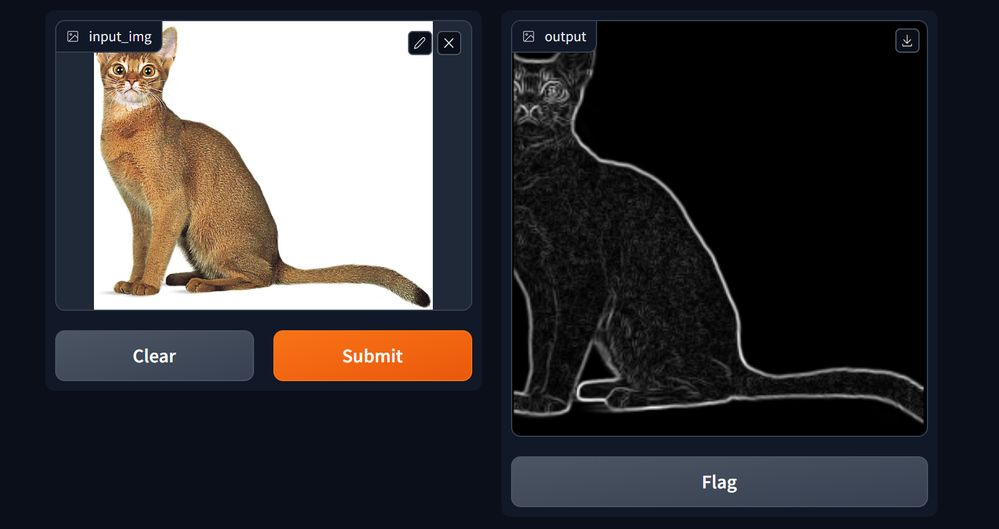

# Sobel Filter

A basic implementation of the Sobel filter using Gradio and numpy



## Build
```
pip install -r requirements.txt
```

## Running

```
gradio app.py
```

or

```
python app.py
```

and open your web browser to `localhost:8080`